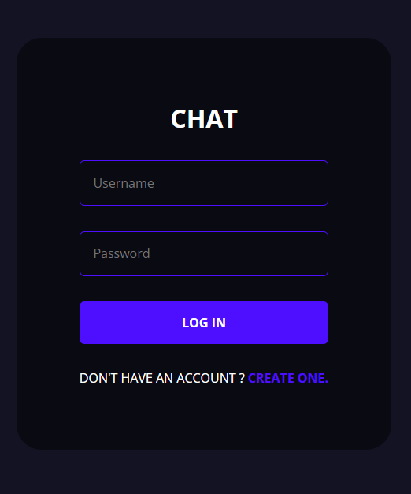
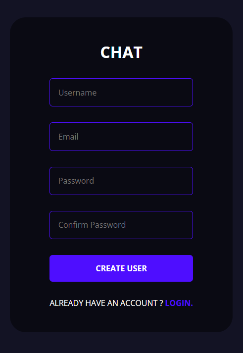
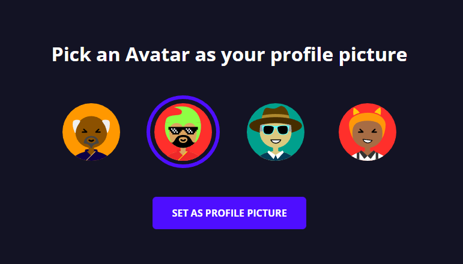
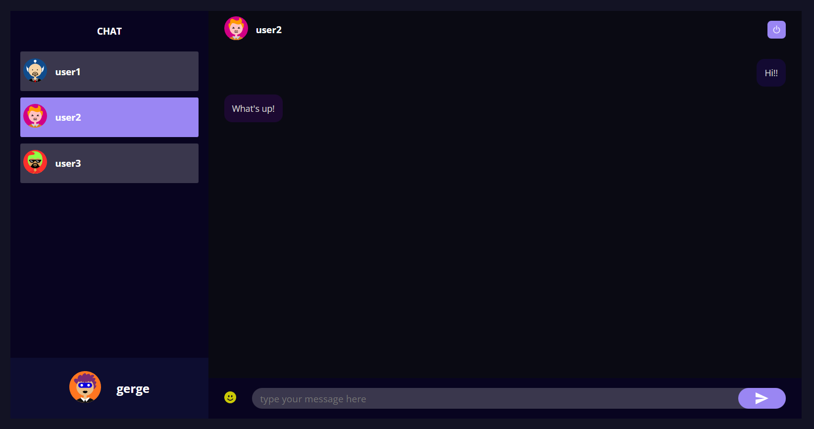
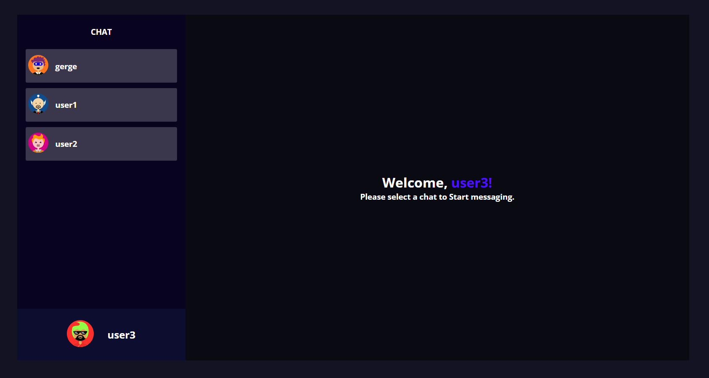

# Socket Chat

El proyecto está llevado a cabo haciendo uso de React, Styled Components, Node, Express, MongoDB (mongoose) y Socket.io.

## Uso

La app permite registro de usuario y login. Selección de una imagen de avatar en caso de no haberlo hecho antes. Las imágenes son extraídas aleatoriamente de https://api.multiavatar.com/. Si ya se ha seleccionado avatar y hay un usuario guardado en localStorage, se dirige a la pantalla del chat. Encontramos la lista de usuarios con sus nombres y avatares desplegados desde MongoDB Atlas. Tenemos la posibilidad de escribir a cualquiera de ellos. Existe también un registro de todos los mensajes escritos hasta el momento. Por medio de Socket.io, el intercambio de mensajes es a tiempo real apareciendo estos al momento en el chat del otro interlocutor.

### `Login & Register`

 

### `Elegir Avatar`

### `Chat`

